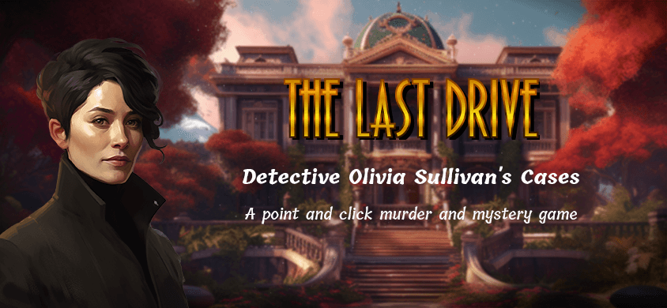

# The Last Drive

## Overview

The Last Drive is a point and click murder and mystery game.

The game is set in 1975, in an affluent community in a small city called Rosewood Ridge. The story begins with the tragic death of philanthropist, Mr. Theodore Sinclair, which initially appears to be a car accident. The player takes on the role of Detective Olivia Sullivan, a meticulously dressed detective with a keen gaze and a notepad always in hand.

## Features

- Dialog systems (action, requirements)
- Navigation systems
- Inventory systems
- Scene interaction systems
- Puzzle systems (padlock, locker, taquin, jigsaw, quiz, sequence)

## Development

The coding structure and systems have been created by B2TGame with me using Phaser as a game engine. All game data is within json files. The project filters the data to generate the game. The game serves as a demo to showcase the power behind the custom structure. 

## Medias

